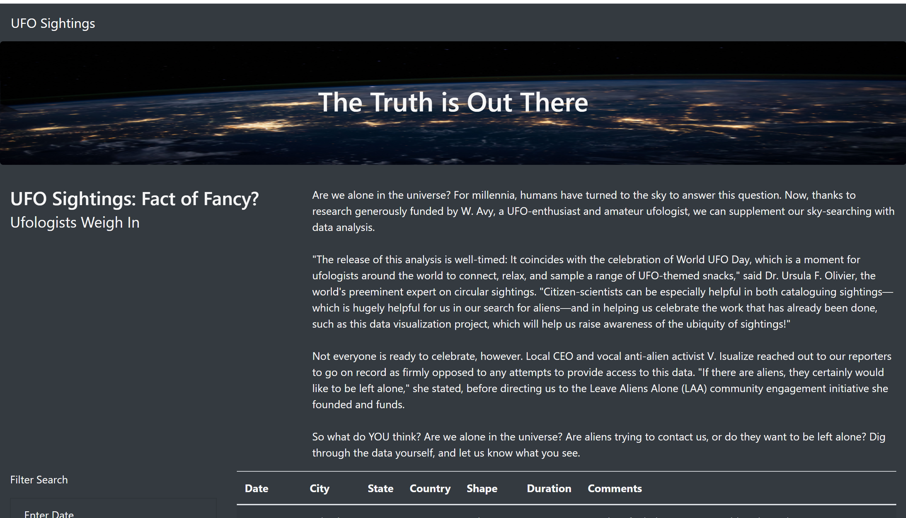
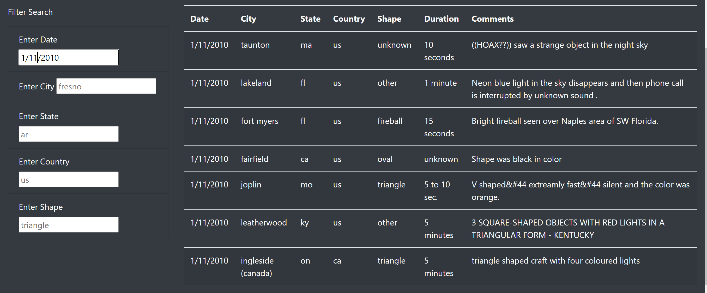
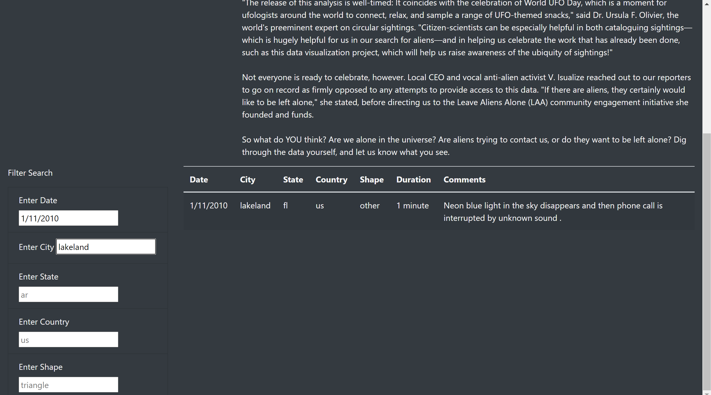

# UFOs

# Overview of Project

I used JavaScript to create a dynamic webpage by inserting my javaScript into an HTML page. I used bootstarp, css and chrome devTools to test my code as I worked through.

I built and styled an interactive and visually appealing table table, using basic HTML, bootstrap and css, to hold the data I want to visualize and added filters to the table as this will help the users to refine their search across the table in more than one level.

## Results

The filter in the webpage allows the users to refine their search using five differnt filters (**date**, **city**, **state**, **country** and **shape** ).

The webpage without filter contains all the information in the data I worked with.

The webpage when filtered with date ***1/10/2010***, the webpage returns only the data for that date.

The webpage when filtered with city ***lakeland***, the webpage returns only the data for that city.

## Summary

One major drawback of this design is that the data setting multiple filters might return an empty table if there are no matches.

Two recommendations for further development will include:

  Making the filters to return at least one data as opposed to an empty table when multiple filters that do not match is used to refine a search

 Making the webpage to update the data in case there is a change

